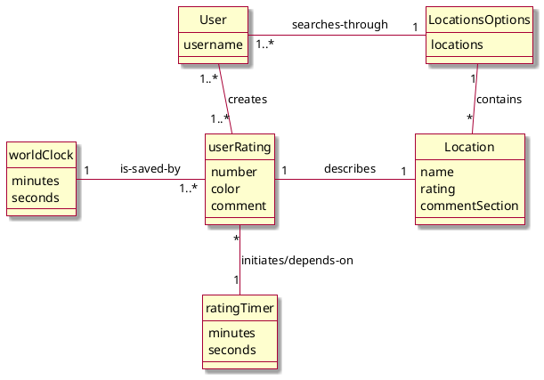
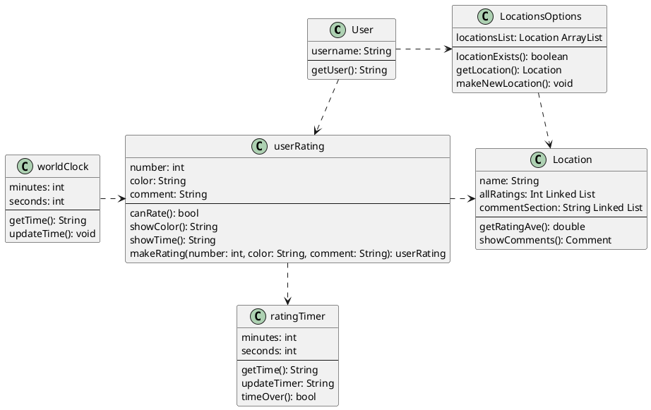
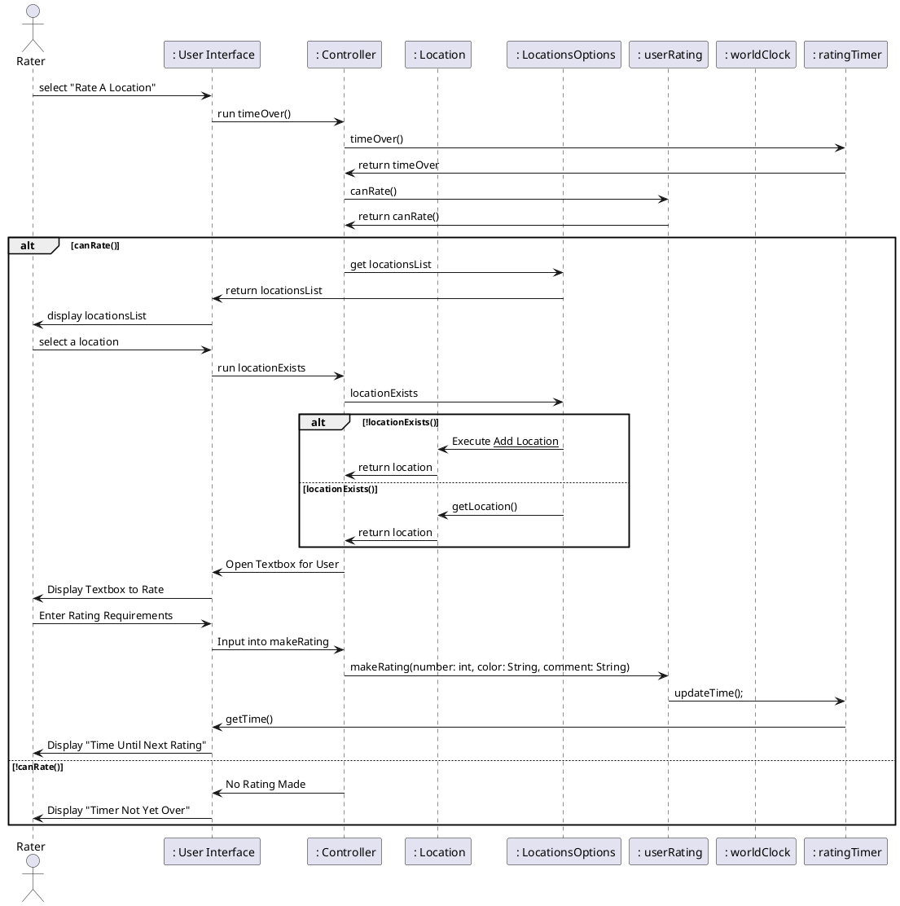

# OVERALL DOMAIN MODEL 



# OVERALL DESIGN CLASS DIAGRAM  



# Sequence diagrams

## Browse locations

```plantuml
actor User as user
participant " :User Interface" as ui
participant " :Controller" as controller
participant " searchName" as sn
participant " :Locations"  as locations
locations -> controller: list of all locations
controller -> ui: list of all locations
ui -> user: display location.name for each location
user -> ui: input desired location name
ui -> controller: desired location name
controller -> sn: searchByName(desired location name)
sn -> locations: search(desired location name)
locations -> sn: desired location
sn -> controller: desired location
controller -> ui: desired location
ui -> user: display desired location info 
@enduml
```

# Report Busyness Sequence Diagram 



# Check Busyness Sequence Diagram

is user done viewing 
    yes 
        end 
    no 
        display locations 
        select desired location 
        is data available 
            yes 
                display overall crowd rating
            no 
                display history of ratings 
        overall crowd rating
        change  time period?
            yes 
                execute time period change
            no 
                add report?
                    yes 
                        execute report busyness
                    no  
                        still viewing?


```plantuml
@startuml
actor Viewer as viewer 
participant " : User Interface" as ui
participant " : Controller" as controller
participant " : Location" as location 
participant " : LocationsOptions" as locOps 
participant " : userRating" as ratings 
participant " : worldClock" as clock 
participant " : ratingTimer" as timer 

viewer -> ui : 
ui -> controller : display locations 
controller -> locOps :  get locationsList
locOps -> controller : return locationsList
controller -> ui : 
ui ->  rater : display locationsList

rater -> ui : select location 
