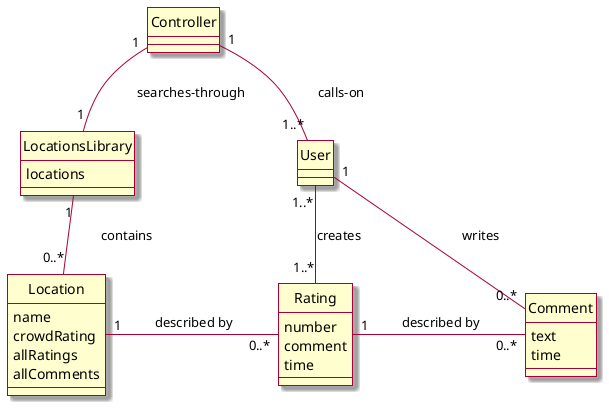
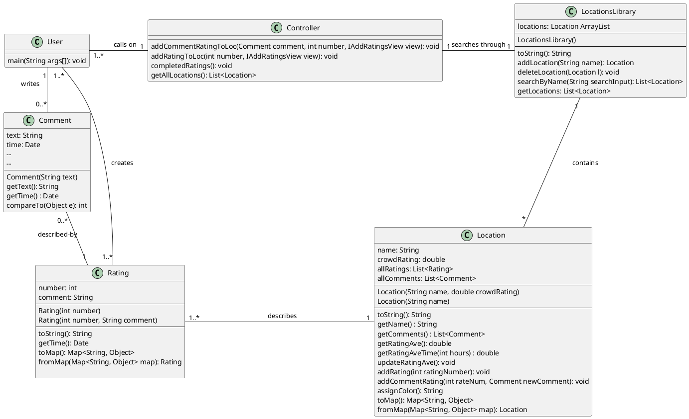
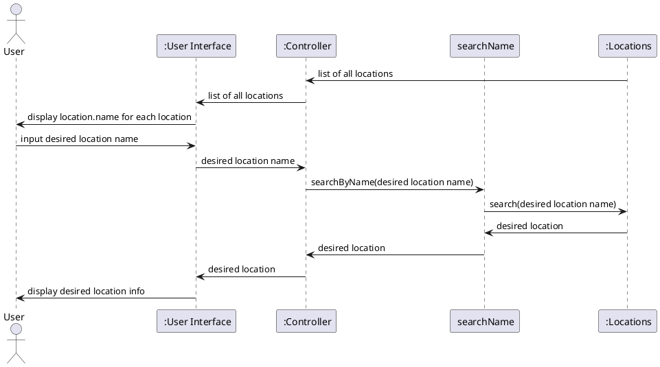
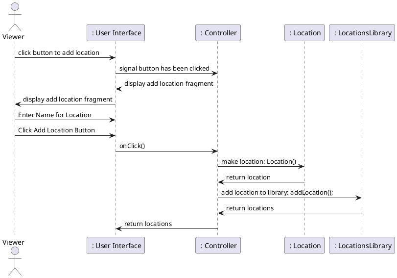
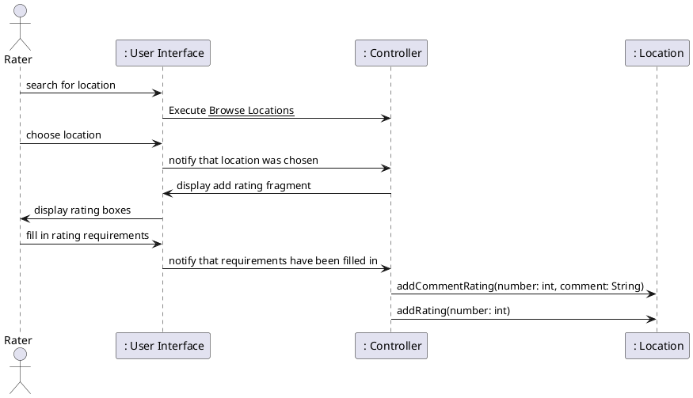
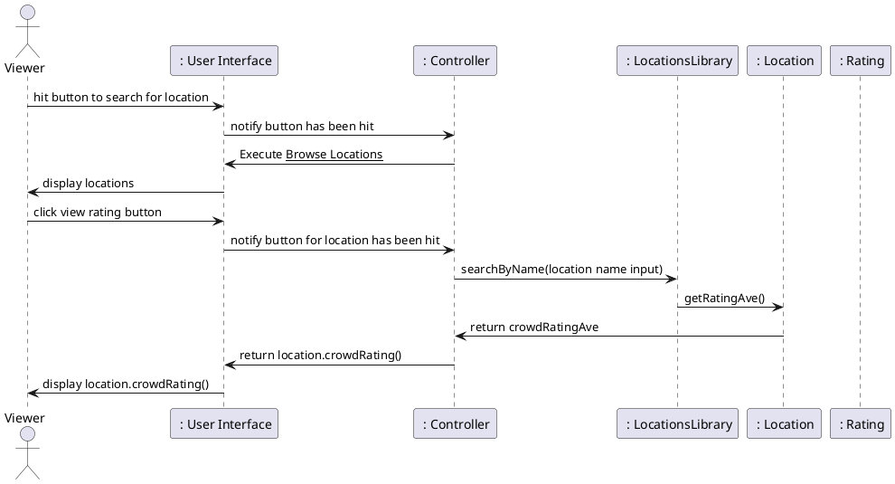

# OVERALL DOMAIN MODEL 

# OVERALL DESIGN CLASS DIAGRAM  

# SEQUENCE DIAGRAMS
## Browse locations

# Add Location Sequence Diagram

# Report Busyness (for already existing location) Sequence Diagram

# Check Busyness Sequence Diagram

