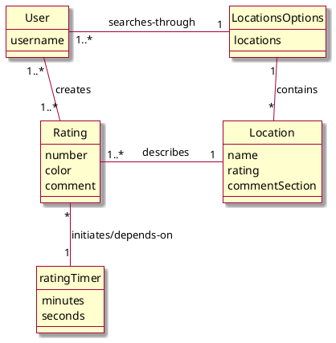
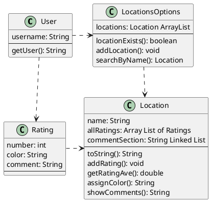
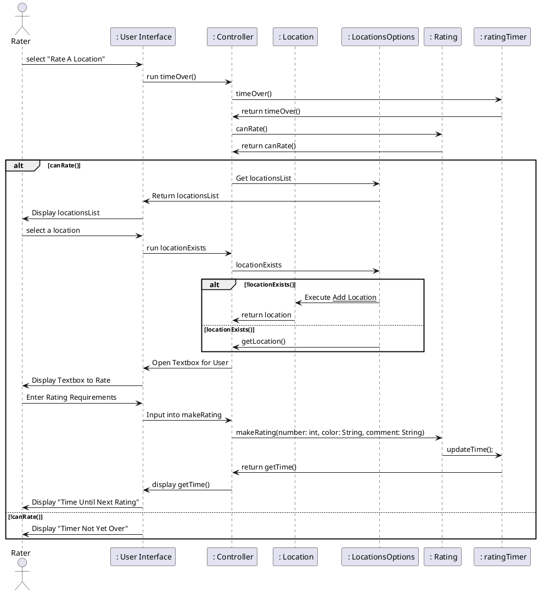

# OVERALL DOMAIN MODEL 



# OVERALL DESIGN CLASS DIAGRAM  



# SEQUENCE DIAGRAMS
## Browse locations

```plantuml
actor User as user
participant " :User Interface" as ui
participant " :Controller" as controller
participant " searchName" as sn
participant " :Locations"  as locations
locations -> controller: list of all locations
controller -> ui: list of all locations
ui -> user: display location.name for each location
user -> ui: input desired location name
ui -> controller: desired location name
controller -> sn: searchByName(desired location name)
sn -> locations: search(desired location name)
locations -> sn: desired location
sn -> controller: desired location
controller -> ui: desired location
ui -> user: display desired location info 
@enduml
```

# Report Busyness Sequence Diagram 



# Check Busyness Sequence Diagram

```plantuml
@startuml
actor Viewer as viewer 
participant " : User Interface" as ui
participant " : Controller" as controller
participant " : Location" as location 
participant " : LocationsOptions" as locOps 
participant " : Rating" as ratings 

ui -> controller : display locations 
controller -> locOps :  get locationsList
locOps -> ui : return locationsList
ui -> viewer : display locationsList
viewer -> ui : Select location

alt locationExists() 
ui -> controller : 
controller -> location: getRatingAve()
location -> controller : return getRatingAve()
controller -> ui : display getRatingAve()
ui -> viewer : display "Want To Add Rating?" and "Yes" "No" options
    alt yes
    viewer -> ui : Choose "Yes"
    ui -> controller : Execute __Report Busyness__
    
    else no 
    viewer -> ui : Choose "No" 
    ui -> controller : Close  
    end


else !locationExists()
ui -> controller: execute __Add Location__

end
