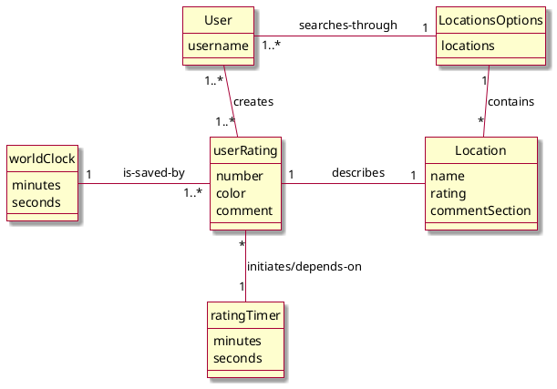
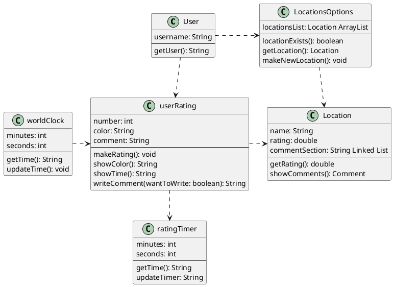

# Domain Model for Entire Program

```plantuml
@startuml

skin rose 

hide circle 
hide circle 

' classes 

class User{
username
}

class userRating{
number
color
comment
}

class LocationsOptions{
locations
}

class Location{
name
rating
commentSection
}

class ratingTimer{
minutes
seconds
}

class worldClock{
minutes
seconds
}

' associations 
userRating "1"  - "1" Location : \t describes \t
userRating "*" -- "1" ratingTimer : initiates/depends-on \t
User "1..*" -- "1..*" userRating : creates
worldClock "1" -right- "1..*" userRating : \t is-saved-by \t
LocationsOptions "1" -down- "*" Location : contains
User "1..*" -right- "1" LocationsOptions: \t searches-through\t

@enduml
```

# DESIGN CLASS DIAGRAM  

```plantuml
@startuml

class User{
username: String
--
getUser(): String
}

class userRating{
number: int
color: String
comment: String
--
makeRating(): void
showColor(): String 
showTime(): String
writeComment(wantToWrite: boolean): String
}

class LocationsOptions{
locationsList: Location ArrayList 
--
locationExists(): boolean
getLocation(): Location
makeNewLocation(): void
}

class Location {
name: String
rating: double
commentSection: String Linked List 
--
getRating(): double
showComments(): Comment
}

class ratingTimer{
minutes: int
seconds: int
--
getTime(): String 
updateTimer: String
}

class worldClock{
minutes: int
seconds: int
--
getTime(): String
updateTime(): void
}


User .down.> userRating
User .> LocationsOptions
userRating .right.> Location
LocationsOptions .down.> Location
userRating .down.> ratingTimer
worldClock .right.> userRating

@enduml
```

