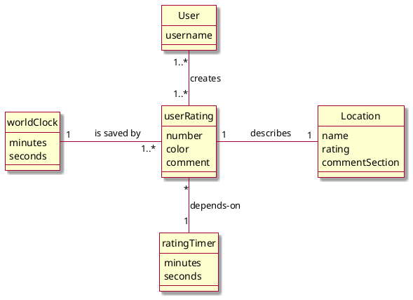

# Domain Model 

```plantuml
@startuml

skin rose 

hide circle 
hide circle 

' classes 

class Location {
name
rating
commentSection
}

class ratingTimer{
minutes
seconds
}

class worldClock{
minutes
seconds
}

class userRating{
number
color
comment
}

class User{
username
}


' associations 
userRating "1"  - "1" Location : \t describes \t
userRating "*" -- "1" ratingTimer : depends-on \t
User "1..*" -- "1..*" userRating : creates
worldClock "1" -right- "1..*" userRating : \t is saved by \t

@enduml
```

# SEQUENCE DIAGRAM 
