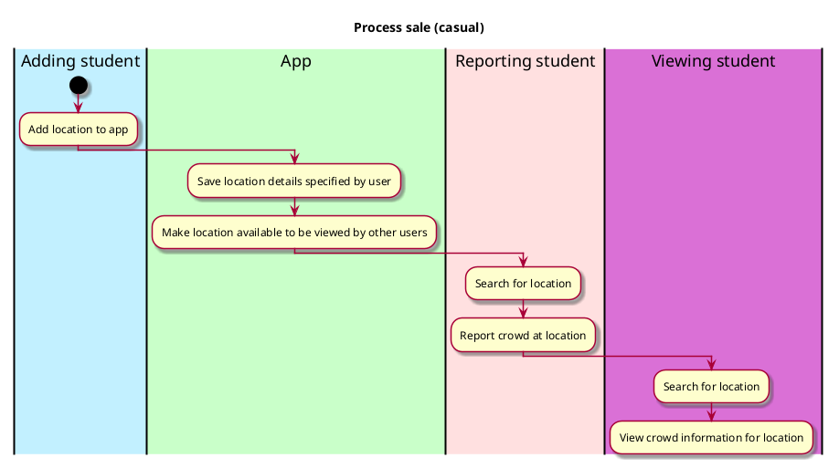

# Add Location

## 1. Primary actor and goals

__Adding student__: Wants to add a location to the app. The new location should be fully integrated into all the app's features and searchable by other users.

## 2. Other stakeholders and their goals

* __Viewing student__: Needs to be able to find the location and check how crowded it currently is
* __Reporting student__: Needs to be able to find the location in the app in order to report how crowded it currently is

## 2. Preconditions

* User must have downloaded the app 

## 4. Postconditions

* Location is now available in app to all users 
* Adding student is notified that the location was added 

## 4. Workflow

