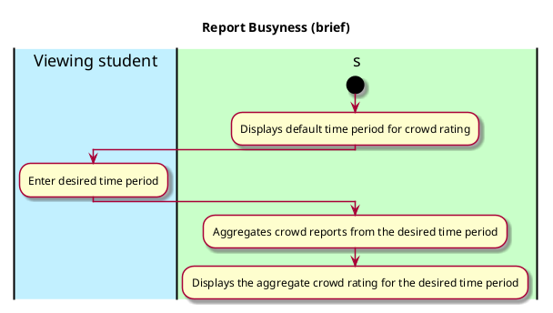

# Change time period

## 1. Primary actor and goals
* __Viewing student__: Wants to alter the time period associated with the aggregate crowd rating for a location displayed by the app. 

## 2. Other stakeholders and their goals

None

## 2. Preconditions

* Viewing student must have found the location in the app for the purpose of checking its crowd rating 

## 4. Postconditions

* Time period is changed according to the preferences of the user

## 4. Workflow

