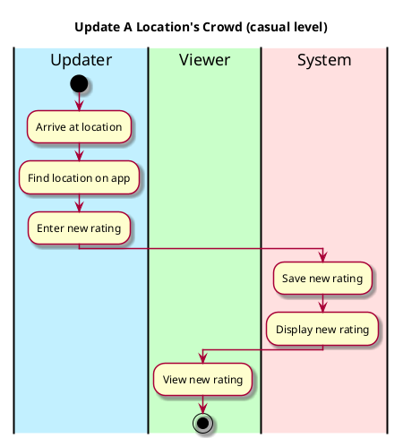

# Use case name, e.g., process sale 

## 1. Primary actor and goals
Who is the main interested party and what goal(s) this use case is designed to help them achieve. For example, for _process sale_:

__Reporting Student__: Wants to update if the area is busy. Wants to change amounts easily.

## 2. Other stakeholders and their goals

* __Viewing Student__: Wants fast service with minimal effort. Wants accurate, fast data updated Wants easily visible display of locations and crowd amounts. 

## 2. Preconditions

What must be true prior to the start of the use case.

* Location is identified and authenticated.
* Student has to be in the location bounds

## 4. Postconditions

What must be true upon successful completion of the use case.

* Crowd busyness update is saved.
* Crowd intensity is recorded and added to the heatmap.
* Location color on map changes accordingly.
* Updates are recorded.

## 4. Workflow

The sequence of steps involved in the execution of the use case, in the form of one or more activity diagrams (please feel free to decompose into multiple diagrams for readability).

The workflow can be specified at different levels of detail:

* __Brief__: main success scenario only;
* __Casual__: most common scenarios and variations;
* __Fully-dressed__: all scenarios and variations.

Please be sure indicate what level of detail the workflow you include represents. 

