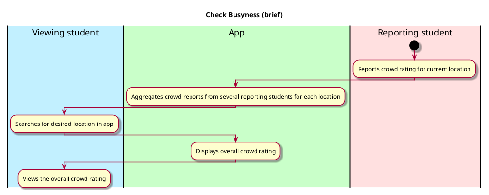
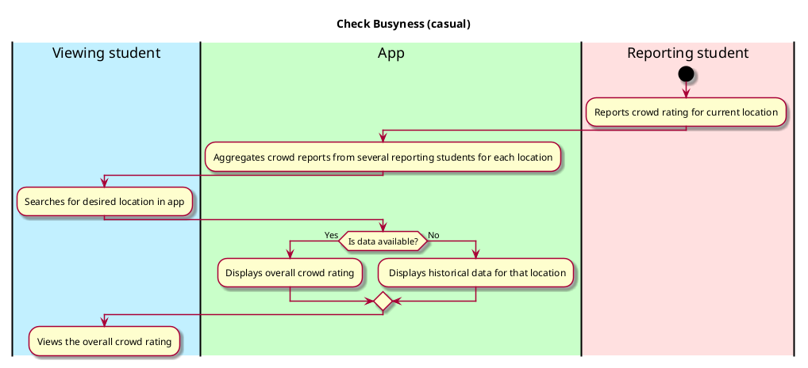

# Check busyness of a location

## 1. Primary actor and goals

* __Viewing student__: Wants to check how busy a particular location on campus is. If no data is available for that location, might want to view historical data for the current day/time.

## 2. Other stakeholders and their goals

* __Reporting student__: Reports the busyness of their current location

## 3. Preconditions

* Location must be available to select in app
* Student must be able to find the location in the app
* Data must have been reported by reporting student (or historical data assembled)

## 4. Postconditions

* Student successfully viewed a summary of how busy the location is

## 5. Workflow

