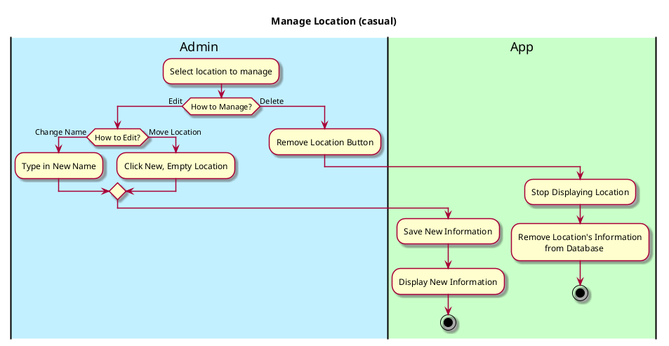

# Manage Location (Edit or Delete)
## 1. Primary actor and goals

* __Admin__: able to edit or delete a particular location in order to prevent duplicate locations, fake locations, etc.
    * Admins are only developers in this version of the ap 
## 2. Other stakeholders and their goals

* None

## 3. Preconditions

* User must be identified and authorized as an administrator
* Location must be available to select in app

## 4. Postconditions

* Other users (viewers and raters) can see changes made by administrator
* Other users cannot override the changes madeby administrator 

## 5. Workflow

