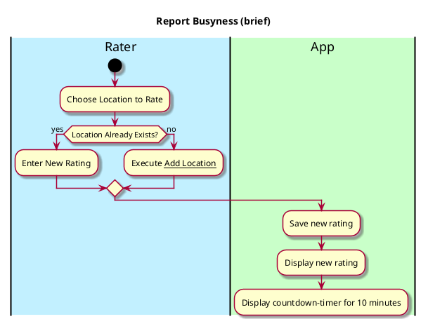

# Report Busyness

## 1. Primary actor and goals
* __Rater__: Wants to update if the area is busy. Wants to change amounts easily.

## 2. Other stakeholders and their goals

* __Viewer__: Wants fast service with minimal effort. Wants accurate, fast data updated Wants easily visible display of locations and crowd amounts. 

## 2. Preconditions

What must be true prior to the start of the use case.

* App has to be downloaded

## 4. Postconditions

What must be true upon successful completion of the use case.

* Crowd busyness update is saved.
* Crowd intensity is recorded and added to the heatmap.
* Location color on map changes accordingly.
* Updates are recorded.

## 4. Workflow

