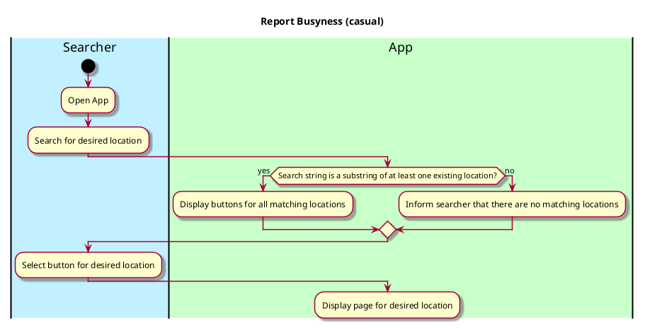

# Search locations

## 1. Primary actor and goals
* __Searcher__: Student user who wants to find a location in the app, either to check or report its busyness. 

## 2. Other stakeholders and their goals

None

## 2. Preconditions

* App must have been downloaded by the searcher
* Location being searched for must have been added to the app

## 4. Postconditions

* User has found the location in the app, and is now able to report or check the busyness of that location 

## 4. Workflow

