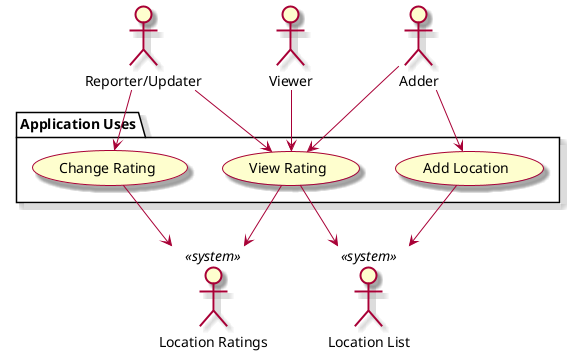

# Vision Document
## Introduction:
We envision an efficient location rating application, specific to Vassar College, with the ability to add new locations.

## Target Audience and Goals 
Who is the target audience for this application? What is this app's purpose for them? What will it help them achieve?

* __Audience__: Vassar Students 
* __Purpose__: To check a location's busyness without needing to be there yet 
* __Goal__: Help students be where they want to be, whether that means finding a quiet study space or a party on weekends.

## Business case
Our software addresses customer needs that other products do not:
1. It can support users adding new locations to the database of Vassar buildings. 
2. It quickly updates in order to reflect as much accuracy as possible. 
3. It saves previous ratings in order to provide as much information as possible when no recent ratings have been made. 
4. It utilizes color in order to address any user confusion about the rating scales.

## Main Features and Key Functionality
Features include:
* Search tab to find a specific location
* Table of specific locations on campus that are available to be rated 
* Rating scale to input and update the busyness of an area 
* Coordinating color palette to ratings of busyness 

## Goals per Actor 

Actors include: Reporting User, Viewing User, System 

* __Reporter/Updater__: Report a busyness quickly with minimal effort 
* __Viewer__: To see the rating and color of specific location searched
  * If no location was searched: can access list of busiest and emptiest locations 
* __Adder__: Adds a new location to the list of locations available to be rated 
* __System__: Update the location's color depending on what the user inputs as a new rating, save old ratings from users, update ratings efficiently

### Use Case Diagram 

