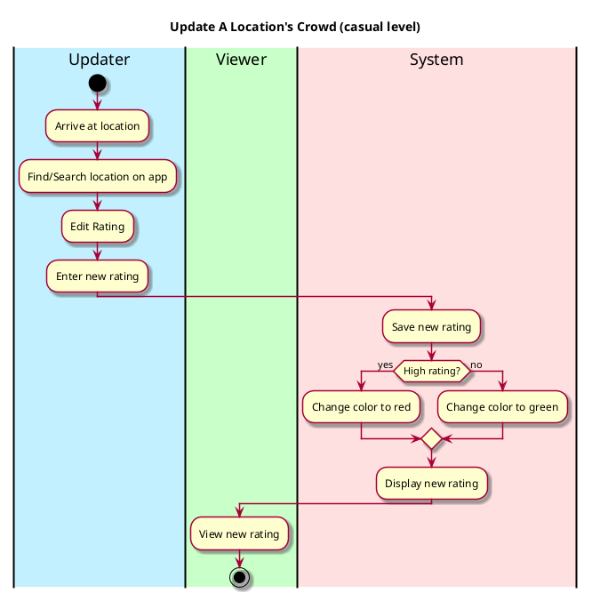

# Vision Document

## Target Audience and Goals 
Who is the target audience for this application? What is this app's purpose for them? What will it help them achieve?

* __Audience__: Vassar Students 
* __Purpose__: To check a location's busyness without needing to be there yet 
* __Goal__: Help students be where they want to be, whether that means finding a quiet study space or a party on weekends.

## Main Features
Features include:
* a search tab to find a specific location
* a table of specific locations on campus that are available to be rated 
* a rating scale to input and update the busyness of an area 
* a coordinating color palette to ratings of busyness 

## Goals per Actor 

Actors include: Reporting User, Viewing User, System 

* __Reporting User__: Report a busyness quickly with minimal effort 
* __Viewing User__: To see the rating and color of specific location searched
  * if no location was searched: can access list of busiest and emptiest locations 
* __System__: Update the location's color depending on what the user inputs as a new rating, save old ratings from users, update ratings efficiently

### General Workflow 

